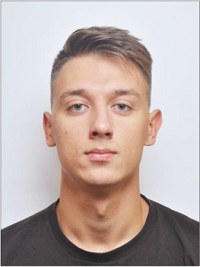

# Serhii Sobol
## Front-end
**Location:** Kyiv, Ukraine  
**Mobile:** +38 (093) 31 44 545  
**E-mail:** itsergeysobol@gmail.com   
**GitHub:** [Serhii Sobol](https://github.com/itsergeysobolit)  
**LinkedIn:** [Serhii Sobol](https://www.linkedin.com/in/serhiisobol/)  
**Telegram:** [@itsergeysobol](https://t.me/itsergeysobol)    

### Summary

Dynamic and motivated developer with good practical experience in HTML5, CSS3, JavaScript. Also, I am ready to learn new ones and expand my current knowledge of the aforementioned as needed to the point where it makes me do my job faster, better and more efficiently. I am looking for new opportunities in Front end development and eager to improve my skills.

### Skills

**Languages:** JavaScript, HTML5, CSS3  
**Familiar with:** Python    
**Operating Systems:** Windows, Linux   
**Preprocessors:** Pug, Sass/Less  
**Libraries/Frameworks:** jQuery, Bootstrap  
**Methodologies:** BEM, Responsive Web Design  
**VCS:** Git, Git flow  
**Others:** Gulp, Continuous Integration, Agile/Scrum, Trello, Adobe Photoshop, Zeplin  

### Soft Skills

* **Analytical Thinking**  — at lyceum won different regional mathematics and physics Olympiads, the medalist of Junior Academy of Sciences of Ukraine 2015, 2013.
* **Cooperation** — enjoy working in a team, I really believe, that two heads are better, than one.
* **Mathematics** — knowledge of algebra, geometry, higher math, and their applications.
* **Leadership** — if I can lead a situation - I will lead it. Have successful experience manage small group of people and achieve aims together.

### Languages

**English:** basic      
**Ukranian/Russian:** native  
**Polish:** pre-intermediate  

### Education

**Years:** 2019-2021    
**Degree:** Master       
**Alma mater:** [Taras Shevchenko National University](http://www.univ.kiev.ua/en/)    
**Major:** Mathematics, Faculty of Mechanics and Mathematics    

**Years:** 2016-2019  
**Degree:** Bachelor  
**Alma mater:** [Taras Shevchenko National University](http://www.univ.kiev.ua/en/)  
**Major:** Integral and Differential Equations, Faculty of Mechanics and Mathematics  

**Years:** 2015-2016  
**Alma mater:** [Kielce University of Technology](https://international.tu.kielce.pl/)   
**Major:** Informatics, Faculty of Electrical Engineering, Automatic Control and Computer Science  

**Years:** 2011-2015  
**Degree:** High School Diploma  
**Alma mater:** [Dnipro Regional Math & Physics Boarding School](https://www.dolifmp.inf.ua/)  
**Major:** Mathematics&Physics   

**Years:** Nov. 2017 - June 2018
**Alma mater:** [Main Academy](https://mainacademy.ua/)  
**Major:** Front-end

**Alma mater:** [freeCodeCamp](https://learn.freecodecamp.org/)    
**Topics:** Responsive Web Design, Javascript Algorithms And Data Structures  